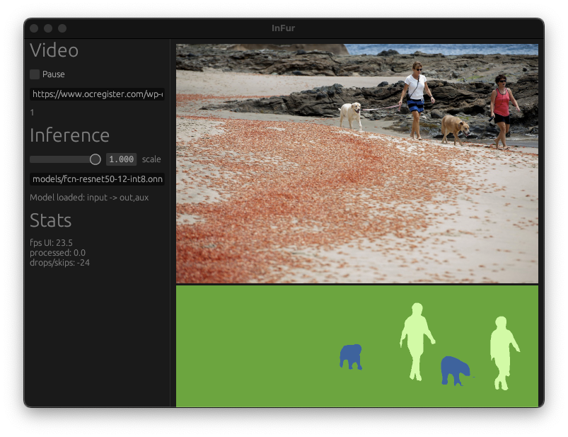
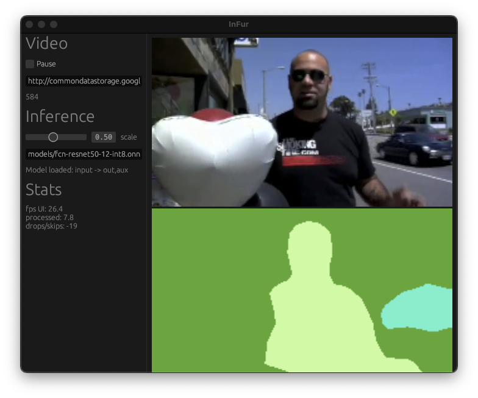
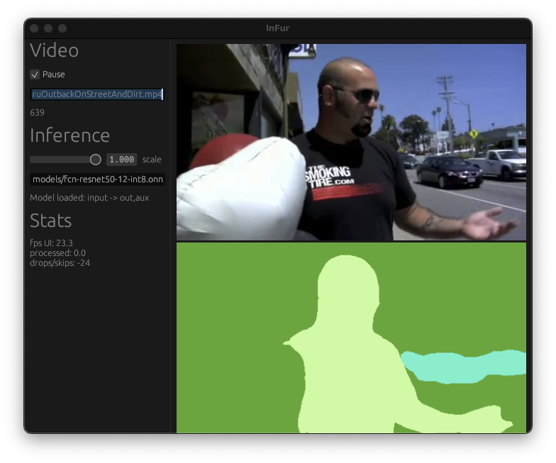

[](https://github.com/ahirner/infur/actions/workflows/test.yaml)

## InFur

`InFur` showcases [ONNX](https://onnx.ai) dense model inference on videos (and images).

[](https://www.ocregister.com/2016/05/16/red-crab-invasion-beaches-at-newport-beach-laguna-beach-covered-by-the-tiny-crustaceans/)

### Requirements

`Infur` should compile on any Tier 1 platform with a recent [Rust](https://www.rust-lang.org) toolchain.

You must also have an [ffmpeg](https://ffmpeg.org) executable in your `PATH` (>=4.3 recommended).

### Test

```
cargo test
```

`cargo test` will ensure synthetic test videos exist in [./media](./media)
and download a [quantized segmentation model](https://github.com/onnx/models/tree/main/vision/object_detection_segmentation/fcn)
to [./models](./models).

#### Windows

The first test run will fail if no `onnxruntime` with Opset support >= 8 is
[on the system path](https://github.com/nbigaouette/onnxruntime-rs/issues/83).
One fix is to copy the `.dll` downloaded by [onnxruntime-sys](https://github.com/nbigaouette/onnxruntime-rs) next to the target `.exe`:

```bash
find target -name onnxruntime.dll -exec cp "{}" target/debug/deps \;
cargo test
```

Copy it also to `debug` and `release` to run the main application
(e.g. `cp target/debug/deps/onnxrutime.dll target/release)`.

### Use

You can provide a video URL to start with:

```
cargo run --release -- http://commondatastorage.googleapis.com/gtv-videos-bucket/sample/SubaruOutbackOnStreetAndDirt.mp4
```

Next, paste the path of the segmentation model from the test fixture into the `Inference` text box:

```
models/fcn-resnet50-12-int8.onnx
```

The model's dense multi-class prediction, i.e. a segmentation mask is color-coded (argmax) and
shaded (by confidence):



A model's output often varies greatly with the scale of the input image. Thus, you can
tune its scale factor on `Pause`:



By default, the app's settings are persisted after closing.

### Todos

The purpose of this crate is to study tradeoffs regarding model inference, native GUIs and
video decoding approaches, in Rust :crab:.

There are a couple of Todos will make `InFur` more intersting beyond exploring
production-readiness as now:

- [ ] GATify `type Output` in `trait Processor`
- [ ] bi-linear image scaling
- [ ] [meta-data aware](https://github.com/onnx/onnx/blob/main/docs/MetadataProps.md#image-category-definition) image pre-processing choices
- [ ] softmax if model predictions are logits (and/or clamp confidence shading)
- [ ] class label captions
- [ ] file-picker for model and video input
- [ ] video fast-forward/backward
- [ ] video seeking
